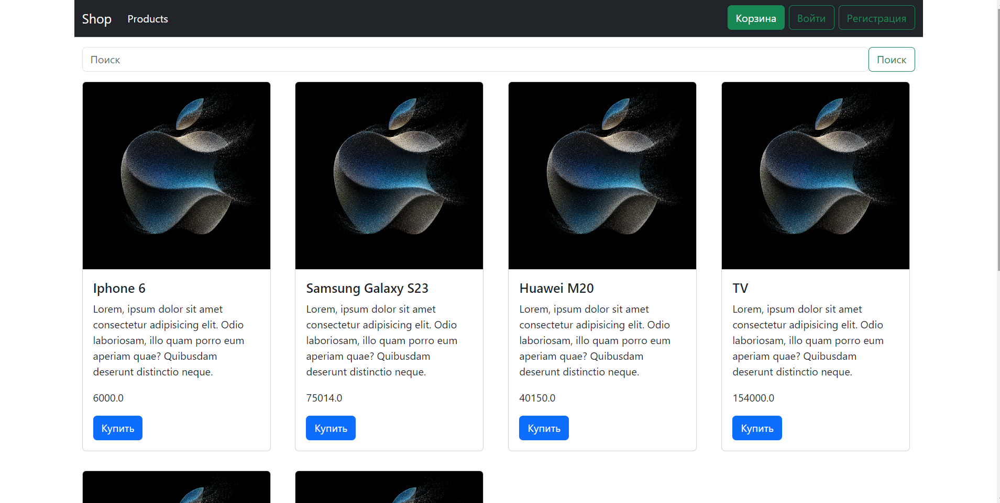

##Приложение Онлайн-магазин

Стэк: Maven, Spring Web, Spring Data JPA, Spring Security, Spring Boot Validation, Thymeleaf, PostgreSQL.

Чтобы запустить это приложение, вам необходимо создать файл .env в корневом каталоге со следующими средами:
POSTGRES_USERNAME= имя пользователя
POSTGRES_PASSWORD= пароль
POSTGRES_NAME_TABLE= название таблицы в базе данных

Дополнительный токен с сайта http://weatherstack.com, можно получить после регистрации 
(Не обязателен для работы основной логики магазина)
TOKEN_WEATHER=

##Скриншот экрана с работающим приложением:

Стэк: Maven, Spring Web, Spring Data JPA, Spring Security, Spring Boot Validation, Thymeleaf, PostgreSQL.
